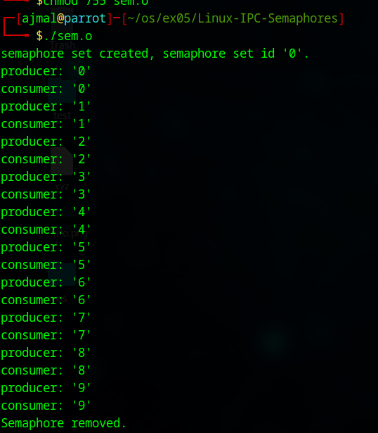
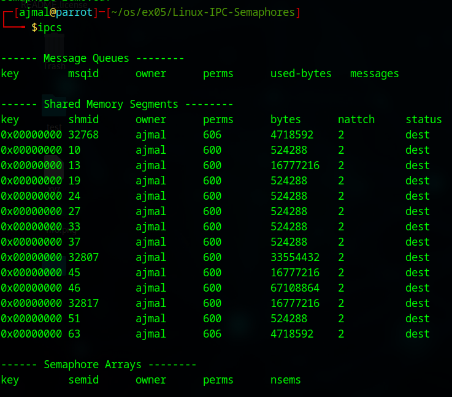

# Linux-IPC-Semaphores
Ex05-Linux IPC-Semaphores

# AIM:
To Write a C program that implements a producer-consumer system with two processes using Semaphores.

# DESIGN STEPS:

### Step 1:

Navigate to any Linux environment installed on the system or installed inside a virtual environment like virtual box/vmware or online linux JSLinux (https://bellard.org/jslinux/vm.html?url=alpine-x86.cfg&mem=192) or docker.

### Step 2:

Write the C Program using Linux Process API - Sempahores

### Step 3:

Execute the C Program for the desired output. 

# PROGRAM:

## Write a C program that implements a producer-consumer system with two processes using Semaphores.
~~~c
#include <stdio.h>      
#include <stdlib.h>     
#include <unistd.h>     
#include <sys/types.h>  
#include <sys/ipc.h>    
#include <sys/sem.h>    
#include <sys/wait.h>   
#include <time.h>      

#define NUM_LOOPS 10  // Number of producer-consumer cycles

// Define union semun if not already available
union semun {
    int val;               
    struct semid_ds *buf;  
    unsigned short int *array; 
    struct seminfo *__buf;
};

// Function to wait (P operation) on semaphore
void wait_semaphore(int sem_set_id) {
    struct sembuf sem_op;
    sem_op.sem_num = 0;
    sem_op.sem_op = -1;  // Decrease semaphore value (Wait)
    sem_op.sem_flg = 0;
    semop(sem_set_id, &sem_op, 1);
}

// Function to signal (V operation) on semaphore
void signal_semaphore(int sem_set_id) {
    struct sembuf sem_op;
    sem_op.sem_num = 0;
    sem_op.sem_op = 1;  // Increase semaphore value (Signal)
    sem_op.sem_flg = 0;
    semop(sem_set_id, &sem_op, 1);
}

int main() {
    int sem_set_id;
    union semun sem_val;
    int child_pid;

    // Create a semaphore set with one semaphore
    sem_set_id = semget(IPC_PRIVATE, 1, 0600);
    if (sem_set_id == -1) {
        perror("semget");
        exit(1);
    }

    printf("semaphore set created, semaphore set id '%d'.\n", sem_set_id);

    // Initialize semaphore to 0 (Consumer must wait for Producer)
    sem_val.val = 0;
    if (semctl(sem_set_id, 0, SETVAL, sem_val) == -1) {
        perror("semctl");
        exit(1);
    }

    // Fork a child process
    child_pid = fork();

    if (child_pid < 0) {
        perror("fork");
        exit(1);
    }

    if (child_pid == 0) {  
        // CHILD PROCESS: Consumer
        for (int i = 0; i < NUM_LOOPS; i++) {
            wait_semaphore(sem_set_id);  // Wait for producer
            printf("consumer: '%d'\n", i);
            fflush(stdout);
        }
        exit(0);
    } else {  
        // PARENT PROCESS: Producer
        for (int i = 0; i < NUM_LOOPS; i++) {
            printf("producer: '%d'\n", i);
            fflush(stdout);
            signal_semaphore(sem_set_id);  // Signal consumer
            usleep(500000); // Sleep to allow consumer to process
        }

        // Wait for child to finish
        wait(NULL);

        // Remove the semaphore set
        semctl(sem_set_id, 0, IPC_RMID, sem_val);
        printf("Semaphore removed.\n");
    }

    return 0;
}

~~~

## OUTPUT
$ ./sem.o 

$ ipcs

# RESULT:
The program is executed successfully.
